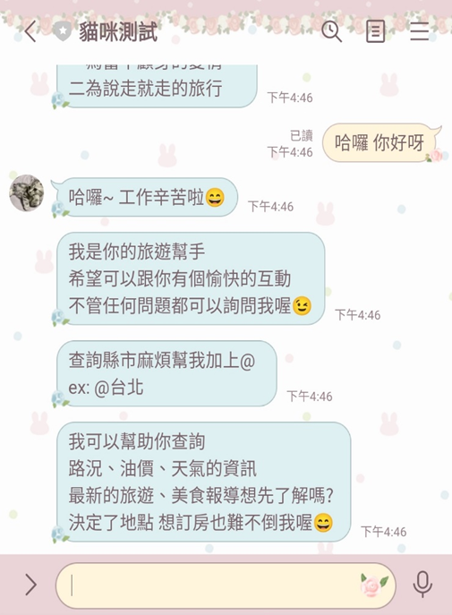
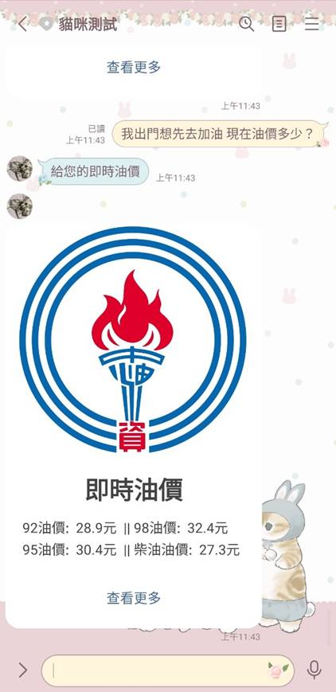
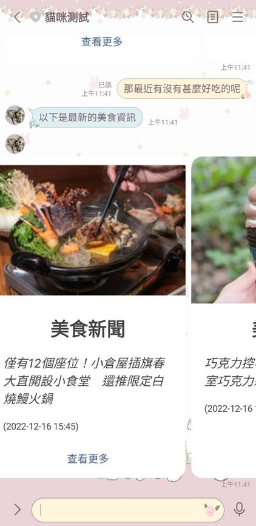
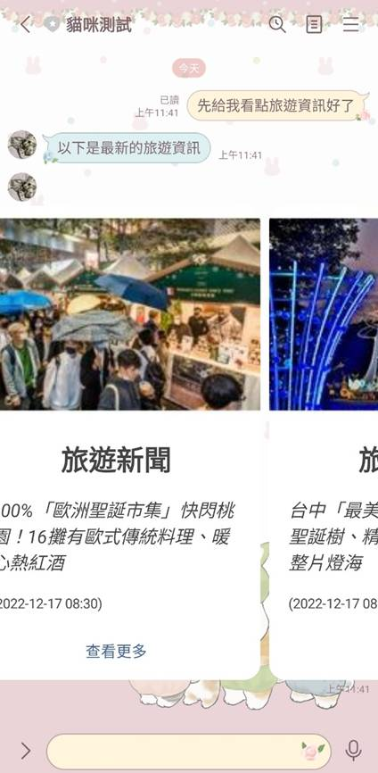
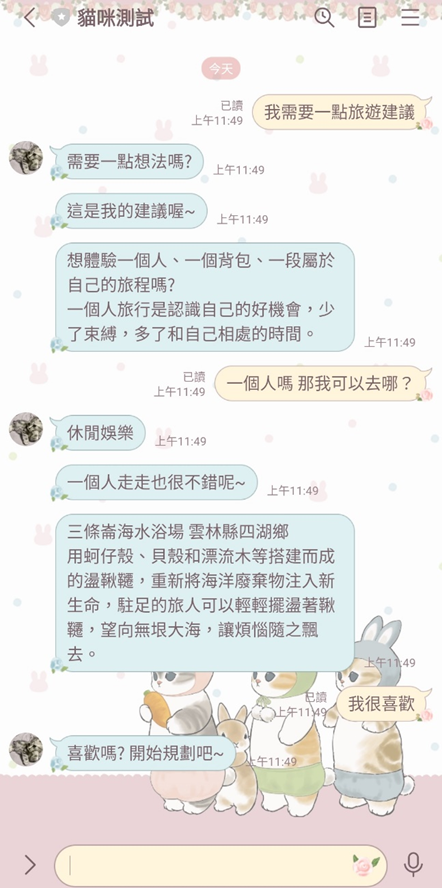

# **基於 BERT 的文本分類互動式旅遊聊天機器人**
📌 **大學專題**（2021-2022）

🚨 **⚠️ 本專案為大學專題，程式碼較為初階，沒有太大的參考價值，且不再維護。**  
🚨 **⚠️ 僅供記錄與展示成果，如有相關需求，建議參考更完善的 BERT 聊天機器人實作。**

---

## **📌 專案介紹**
本專案使用 **BERT (Bidirectional Encoder Representations from Transformers)** 進行文本分類，  
將使用者的簡短問題分類為最相似的關鍵字，透過 **LineBot** 回復適當的答案，完成基本的旅遊 Q&A 聊天機器人功能。

### **📸 專題成果展示**
以下是本專題的測試結果與成果展示(部分)：

#### 1️⃣ LineBot 介面

#### 2️⃣ 網頁爬蟲功能

  
  
  

#### 3️⃣ 機器人建議

---

## **📁 專案結構**
### **📌 主要程式**
| 檔案 | 說明 |
|------|------|
| `train.py` | BERT 模型訓練 (fine-tune) |
| `predict.py` | 文字分類與預測 |
| `core.py` | 模型預測與訓練的核心函數 |
| `test1.ipynb` | 測試模型分類結果 |
| `data.json` | 使用者訊息存放 |
| `config.ini` | LineBot 金鑰存放位置 |
| `app.py` | 專案主程式 |

### **📌 資料夾**
| 資料夾 | 說明 |
|------|------|
| `function/` | LineBot 功能函數 |
| `trained_model/` | 訓練好的模型（此專案不包含模型權重） |

### **📌 BERT 必要檔案**
| 檔案 | 說明 |
|------|------|
| `bert-base-chinese-vocab.txt` | BERT 字典 |
| `travel_QA.txt` | 訓練資料集（若更改名稱，需同步修改程式路徑） |

---

## **🚀 使用方式**
1. 執行 `train.py` 訓練模型，會生成 `trained_model` 內所需的權重檔案。
2. 設定 **LineBot 金鑰** (`channel_access_token`, `channel_secret`)。
3. 使用 `ngrok` 開啟對應的 port（與 `app.py` 指定的 port 相同）。
4. 執行 `app.py` 啟動服務。
5. 前往 **Line Developers** 平台，設定 **Webhook URL** 來連結機器人。

---

## **🛠 環境需求**
- **Python** 3.7+
- **PyTorch** 1.3+
- **Flask** 2.2+
- **line-bot-sdk** 2.2+
- **beautifulsoup4** 4.1+
- 其他相依套件可參考 `requirements.txt`

---

## 📖 參考來源
本專案的部分程式碼參考了以下開源專案：

- **[taipei-QA-BERT](https://github.com/p208p2002/taipei-QA-BERT)**  
  - 主要參考了 `train.py` 的 BERT 訓練流程  
  - `predict.py` 的文本分類與推論機制  
  - `core.py` 內的一些 BERT 相關函數  

感謝 [p208p2002](https://github.com/p208p2002) 提供的開源專案，讓我們能夠學習並改進這個聊天機器人！

## **⚠️ 注意事項**
- 這是一個 **學術專題**，程式碼未經最佳化，可能有許多可以改進的地方。
- 本專案 **不再維護**，若要實際開發商用聊天機器人，建議參考更完善的框架或開源專案。
- 若需使用 **LineBot** 服務，請自行申請 `channel_access_token` 和 `channel_secret`，本專案不包含任何機密資訊。

---

